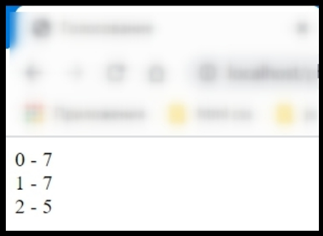
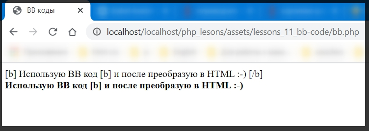
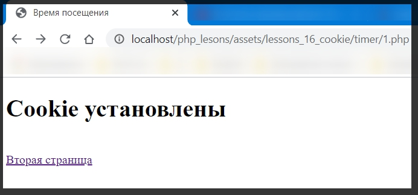

<h1 align="center">Язык PHP</h1>

<h2 align="center">Счетчик посещений</h2>

На многих сайтах в сети Internet для подсчета числа посетителей сайта используют счетчики посещений. Алгоритм работы счетчика представлен следующей блок схемой: 

Программа (Сценарий) на языке PHP реализующая этот алгоритм:

[counter.php](../lessons_1_counter/counter.php)

****

 

[couter_1.php](../lessons_1_counter/md/counter_1.md)

****

 

[counter_2.php](../lessons_1_counter/md/counter_2.md)

[counter.txt](../lessons_1_counter/md/counter_txt.md)

****

    

# Формы HTML

Для работы с переменными, переданными из HTML форм, в PHP используются специальные служебные массивы: 
**&#36;_POST** - массив, содержащий переменные, переданные методом *post* 
**&#36;_GET** - массив, содержащий переменные, переданные методом *get* 
**&#36;_REQUEST** - массив, содержащий переменные, переданные методами **post**,**get** и переменные связанные с **cookie** 
До PHP версии 4.1.0 так же использовались **&#36;HTTP_POST_VARS** и **&#36;HTTP_GET_VARS** сейчас они оставлены для совместимости, однако их поддержка не гарантируется в 5 версии. 
Так же доступ к переменным переданным из HTML форм можно получить без использования этих массивов, если в конфигурационном файле **php.ini** включена соответствующая директива: 
**register_globals=on** 
В этом случае php создает переменные с такими же именами и значениями как у переменных переданных из HTML форм. При этом возникает проблема с определением, каким именно методом была передана переменная. На работу этой директивы влияет директива **variables_order**, определяющая какие переменные и в каком порядке будут обрабатываться директивой **register_globals**,  по умолчанию ее значение EGPCS(Enviroment, GET, POST,Cookie, Server).
  

>&#9888;  Начиная с версии PHP 4.2.0, в целях обеспечения безопасности      значением по умолчанию для **register_globals** является **off**.

    

<h2 align="center">Голосование</h2>

[vot.html](../lessons_2_voting/voting_1_text_file/voting_1_md/vot.md)

[vot.php](../lessons_2_voting/voting_1_text_file/voting_1_md/vot_php.md)

 

[votData.txt](../lessons_2_voting/voting_1_text_file/md/votdate.md)

****

Текстовый редактор **[Блокнот](https://notepad-plus-plus.org/)** работает с окончаниями строк в Windows формате, в то время как **PHP** выставляет окончания строк в Unix формате. Поэтому для работы с файлами сгенерированными с помощью PHP лучше использовать специализированные текстовые редакторы такие как 

* [PhpStorm](https://www.jetbrains.com/phpstorm/)
* [Visual Studio Code](https://code.visualstudio.com/)
* [Sublime Text](https://www.sublimetext.com/3)
* [Brackets](http://brackets.io/)
* [Eclips](https://www.eclipse.org/downloads/)
* [Atom](https://atom.io/)
* [NetBeans](https://netbeans.org/)

  

**Пример data.json**

[votform.html](../lessons_2_voting/voting_2_json/md/votform.md)

[vot.php](../lessons_2_voting/voting_2_json/md/vot.md)

[data.json](../lessons_2_voting/voting_2_json/md/dataJson.md)

 

****

Пример **serialize**

[votform.html](../lessons_2_voting/voting_3_serialize/md/votform.md)

[vot.php](../lessons_2_voting/voting_3_serialize/md/vot.md)

[data.serialize](../lessons_2_voting/voting_3_serialize/md/data.serialize.md)

****

Бывает очень удобно хранить всю информацию о голосовании(вопрос, варианты ответов и результаты голосования) в одном файле.

[votconf.php](../lessons_3/votconf_json/votconf.php)

[votform.php](../lessons_3/votconf/md/votform.md)

[vot.php](../lessons_3/votconf/md/vot.md)

[votData.txt](../lessons_3/votconf/md/votData.md)

   

Пример **json**

[votform.php](../lessons_3/votconf_json/votform.php)

[vot.php](../lessons_3/votconf_json/md/vot.md)

[votconf.php](../lessons_3/votconf_json/votconf.php)

[data.json](../lessons_3/votconf_json/md/datajson.md)

****

     

<h1 align="center">Работа с СУБД</h1>

В web - программировании для хранения информации часто используются различными системами управления базами данных СУБД. СУБД позволяют хранить большие объемы данных, предоставляя при этом одновременно мощный и простой инструмент для работы с данными - структурированный язык запростов (SQL).

На сегодняшний день в мире насчитывается десятки различных СУБД,
поддерживающих работу как ANSI SQL, так и различные его расширения. На сегодняшний день одной из наиболее популярных СУБД в области Web - программирования является MySql.

В 4-й версии PHP, СУБД встроена в интерпретатор. Встроенаая в PHP 4 клиентская библиотека имеет версию 4.1.0. В PHP 5 - й версии  СУБД MySql находится на *"общем положении"*, т.е. клиентская библиотека больше не встраивается в интерпретатор. Однако в PHP 5 появилось новое рассширение ***MySql Improved*** позволяющее использовать как функциональность доступную в MySql версии ***4.1.3***  так и функциональность более поздних версий. Такое положение вещей заставляет разработчиков обратить свое внимание на другие СУБД. Так ничиная с PHP 5 - ой версии, появилась поддержка встраиваемой СУБД **SQLite**. SQLite является полноценной СУБД, встроенной в интепритатор и позволяющей напрямую работать с файлами базы данных, а не клиентской библиотеки для связи с сервером, как в случае с большинством других СУБД.

Однако многие СУБД (например **InterBase**) работающие по технологии *"клиент - сервер"* так же могут поставляться ввиде встраиваемой библиотеки (так называемой ***Embedded*Server**).

PHP поддерживает широкий круг СУБД.

* Addas D
* dBase
* Empress
* FilePro (только чтение)
* Hyperweve
* IBM DB2
* Informix
* Ingres
* InterBase
* FrontBase
* mSQL
* Direct MS-SQL
* MySQL
* ODBS
* Oracle(OCI7 и OSI8)
* Ovrimos
* PostgreSQL
* SQLite
* Solid
* Sybase
* Velocis
* Unix dbm

<h2 align="center">Гостевая книга (MySQL)</h2>

Гостевые книги - широко используемый в web сервис, позволяющий посетителям сайтов оставлять текстовые сообщения доступные в последствии как администрации сайта так и другим посетителям. Все сообщения записываюся в базу данных, а при обращении пользователя генерируется html страница, содержащая сообщения из базы данных.

****

  

[gb.php](../Lessons_4_questbook/gb/md/gb.md)

   

**Пример ООП**

[gb.php](../Lessons_4_questbook/gb%20_oop/md/gb.md)

    

Часто бывает удобно разбивать задачу на несколько модулей

  

[add.php](../Lessons_4_questbook/gb_mod/md/add.md)

[config.php](../Lessons_4_questbook/gb_mod/md/config.md)

[connect.php](../Lessons_4_questbook/gb_mod/md/connect.md)

[gb.php](../Lessons_4_questbook/gb_mod/md/gb.md)

[install.php](../Lessons_4_questbook/gb_mod/md/install.md)

[install.sql](../Lessons_4_questbook/gb_mod/md/instalSQL.md)

[show.php](../Lessons_4_questbook/gb_mod/md/show.md)

     

# Регулярные выражения

### *Фильтр*

Очень часто при решении прикладных задач в области web - программирования приходится решать ряд задач связанных с обработкой тестов. К типовым задачам обработки текста относятся: проверка правильности записи адреса электронной почты, проверка правильности заполнения различных регистрационных форм, и форм заказов  в Интернет магазинах, фильтрация нецензурных выражений на форумах, досках объявлений, гостевых книгах и чатах, замена последовательностей символов (смайликов) на теги содержащие адреса соответствующих картинок, и др.

Наиболее мощное средство для решения подобных задач это язык регулярных выражений. Начало разработки теории регулярных выражений датируется 1940 - ми годами и работами Уоррена Маккалака и Уолтера Питтса.

Регулярное выражение (англ. regular expession) - формальное описание алгоритма поиска символьных комбинаций в тексте, записанное на специальном языке. Сам алгоритм, задающий правило поиска, называется &#171;шаблоном&#187; &#171;маской&#187;  или  &#171;образом&#187;.(англ.pattern).

Для фильтрации содержимого web - страниц часто используемые фильтры на основе регулярных выражений. При помощи фильтров проверяется наличие запрещенных выражений после чего производится решение - что делать с этим содержимым.

 

[marcdown.php](../lessons_5_regexp/md/marcdown.md)

****

   

[list.php](../lessons_6_CRUD/md/list.md)

[upload.php](../lessons_6_CRUD/md/upload.md)

Мы можем выбрать интересующие нас файлы и добавить их в папку files после добавления файлов, мы можем отобразить данные файлы.

Картинка 

Пример txt.

****

  

Пример с нецензурным выражением

[filtr.php](../lessons_7_filtr/md/filtr.md)

     

**Смайлики**

В форумах, чатах, гостевых книгах используются символьные последовательности, обозначающие эмоции (смайлики), часто их заменяют графическим изображением.

[smile.php](../lessons_8_emoji/md/emoji.md)

    

Иногда надо заменять несколько последовательностей.

[smile2.php](../lessons_8_emoji/md/smile2.md)

    

**Пример с Emoji**

[emoji.php](../lessons_8_emoji/md/emoji.md)

  

****

***Примеры используемых кодов***

|&#129303; &amp;#129303;|&#128518; &amp;#128518;|&#128515; &amp;#128515;|
|:---|:---|:---|

    

<h1 align="center">Графический счетчик</h1>

Счетчик посещений может быть в графическом виде, где каждая цифра в числе счетчика заменяется на тег картинки, с изображением соответствующего числа.

[counter.php](../lessons_10_counter/md/conter.md)

     

<h1>BB коды</h1>

В форумах, чатах, гостевых книгах запрещают использование HTML тегов, так как с их помощью можно, например встроить вредоностный скрипт способный украсть информацию содержащуюся в файлах  cookie. А для того что бы дать пользователю возможность выделять текст (жирным, курсивом и т.д.) используют так называемые BB коды. BB коды - это аналоги соответствующих HTML тегов, с той лишь разницей что угловые скобки заменяют на прямоугольные. Затем BB коды, с помощью специального регулярного выражения, заменяют на соответствующие HTML теги.

Замена одного BB кода:

[bb.php](../lessons_11_bb-code/md/bb.md)

   

Замена нескольких BB кодов с запретом HTML тегов:

[bb2.php](../lessons_11_bb-code/md/bb2.md)

    

[bb3.php](../lessons_11_bb-code/md/bb3.md)

     

<h1 align ="center">e-mail</h1>

При регистрации на различных сайтах в сети Интернет, часто просят ввести адрес электронной почты, который потом проверяется на соответствие правилам записи(наличиек символа @ и т.д.).

[mail.html](../lessons_12_email/md/mail_html.md)

[mail.php](../lessons_12_email/md/mail_php.md)

  

Или более сложный вариант:

  

[mail.html](../lessons_13_email2/md/mail_2_html.md)

[mail.php](../lessons_13_email2/md/mail_2_php.md)

     

<h1 align="center">Шаблоны</h1>

Что бы не дублировать дизайн сайта, на каждой его странице используют шаблон в который встраиваются остальные страницы сайта, при этом то какая именно страница будет встроена в шаблон определяется параметром, передаваемым скрипту шаблоном. Как правило он передается методом GET (например http://127.0.0.1/1/main.php?pg=pg2).

  

[main.php](../lessons_14_templates/md/main.md)

[one.php](../lessons_14_templates/md/one.md)

[two.php](../lessons_14_templates/md/two.md)

[three.php](../lessons_14_templates/md/three.md)

     

<h1 align="center">Голосование</h1>

Для того что бы встроить голосование в шаблон, форма с голосованием должна передавать скрипту содержащему шаблон параметр, определяющий что встраиваться в шаблон должен файл, показывающий результаты голосования.

(action="main.php?pg=vot" или просто action="?pg=vot" если это ссылка на тот же файл где находится форма, этот параметр передается методом GET), остальные параметры передаются методом POST.

  

[main.php](../lessons_15_template_voting/md/main.md)

[one.php](../lessons_15_template_voting/md/one.md)

[two.php](../lessons_15_template_voting/md/two.md)

[three.php](../lessons_15_template_voting/md/three.md)

[vot.php](../lessons_15_template_voting/md/vot.md)

     

<h1 align="center">Сookie</h1>

Для ослеживания отдельно взятого посетителя на сайте используются файлы cokie. Сookie являются частью HTTP заголовка, поэтому операторы устанавливающие их (как и все операторы изменяющие HTTP заголовки), должны называться до передачи основного содержимого Web - страницы.

    

<h2 align="center">Таймер</h2>

На первой странице устанавливаются сookie содержащие время ее посещения.

[1.php](../lessons_16_cookie/md/timer_1.md)

на второй странице выводится время посещения первой страницы.

[2.php](../lessons_16_cookie/md/timer_2.md)

  

<h3 align="center">Счетчик</h3>

При помощи cookie  можно организовать счетчик посещений сайта каждым отдельно взятым пользователем.

[1.php](../lessons_16_cookie/md/cookie_counter_1.md)

[2.php](../lessons_16_cookie/md/cookie_counter.2md)

В приведенных выше параметрах файлы cookie будут хранится у клиента до закрытия браузера. Так же функция **setcookie** поддерживает следующие параметры:

|Параметры|Назначение|
|:---:|:---:|
|**Name**|Имя переменной cookie|
|**Value**| Значение переменной|
|**Expire**| Время (в Unix формате, т.е. количество секунд прошедших с января 1970года) до которого должна храниться переменная у клиента. Если время не установлено, то cookie храняться до закрытия браузера.
|**Path**| Путь на сервере, по которому будут доступны устанавливаемые cookie|
|**Secure**| Должны ли cookie передаваться только через защищенное соединение( по умолчанию FALSE)|

    

<h1>Сессии</h1>

В отличие от cookie при авторизации с использованием сессий вся информация хранится в файлах сессий находящихся на сервере, а не в файлах cookie находящихся у клиента, а файлы cookie используются для хранения SID.

**SID** - строка вида ***name = ID***, Содержащая имя сессии (по умолчанию **PHPSESSID**) и индификатор сессии (имя файла в котором хранятся сессионные переменные), которые представляют собой строку, содержащую случайную последовательность символов из диапазона **a - z, A -Z, и 0 - 9** (например 382b117414a477084ab1010a53bfb0c).

А так же как файлы cookie используются для отслеживания пользователя находящегося на сайте, стартовать новую сессию нужно до вывода содержимого Web - страницы.

На тот случай если у клиента, по каким либо причинам, блокируется файлы cookie, в PHP реализован альтернативный механизм сессий, позволяющий передавать SID как URL параметр.

При этом во всех ссылках в которых явным образом не указан адрес сервера (т.е. ведущих на этот же сервер) жописывается SID(например ***http://127.0.0.1/count/2.php?PHPSESSID=bb5700f6d30c91e3ef0fe1d6068d74a8***). 

Использование файлов cookie является предпочительным, т.к. это предоставляет злоумышлинникам меньше возможностей для атак. Так, например, при использовании сессии основанных на URL пользователь может послать по почте URL содержащий SID другому пользователю, который сможет получить доступ к сайту с темиже сессионными переменными. 

  

<h3 align="center">Таймер</h3>

На первой странице начинается новая или востанавливается настоящая сессия, затем сессионной переменной **time** присваивается текущее значение времени.

[1.php](../lessons_17_session/md/timer_1.md)

На второй странице восстанавливается существующая сессия и выводится время прошедшее с момента посещения первой страницы. 

[2.php](../lessons_17_session/md/timer_2.md)

<h3 align = "center">Счетчик</h3>

[1.php](../lessons_17_session/md/counter_1.md)

[2.php](../lessons_17_session/md/counter_2.md)

<h1>Загрузка файлов на сервер (UpLoad)</h1>

При решении различных задач Web - программирования часто встает задача не только получения данных с web - сервера, но и загрузки файлов на сервер(файла с картинкой в web - галерею, доски обмена файлами и т.д.).

Основную работу по загрузке файлов на сервер, PHP берет на себя. При этом принимаемые файлы находятся во временной директории, а вся информация о принятом файле хранится в массиве **$_FILES**. После выполнения скрипта, принимающего файл, принятый файл будет автоматически удален из временной директории, вне зависимости от того был он скопирован или нет.

[list.php](../lessons_18_UpLoad/md/list.md)

[up.html](../lessons_18_UpLoad/md/up_html.md)

[up.php](../lessons_18_UpLoad/md/up_php.md)

За загрузку файлов в PHP отвечают следующие директивы в файле **php.ini**

Разрешение PHP на закачку файлов.
**file_uploads** = On

Директория для временного хранения закачиваемых файлов
**upload_tmp_dir** = \PHP\uploadtemp

максимально допустимый размер закачиваемых файлов 

**upload_max_filesize** = 2M

            